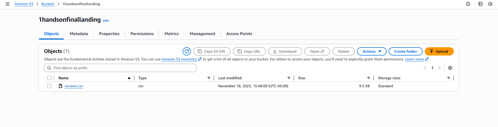
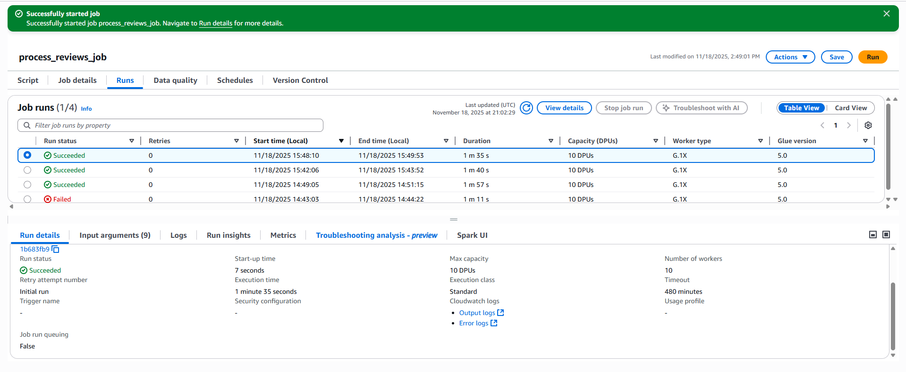
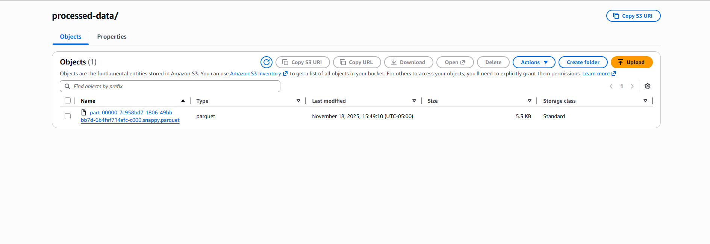
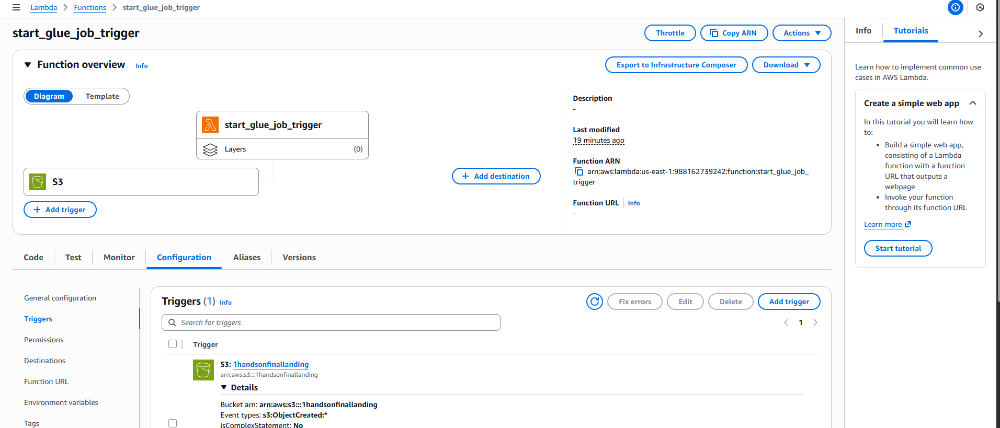
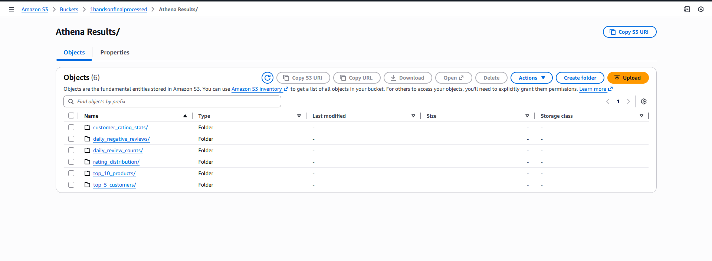

# Serverless Spark ETL Pipeline on AWS (Product Reviews)

This repo contains my solution for **ITCS 6190/8190 – Hands-on L13: Serverless Spark ETL Pipeline on AWS**.  
It implements an event-driven pipeline on AWS: when a new product review CSV is uploaded to S3, a Lambda function starts a Glue Spark ETL job that cleans the data, runs analytics, and writes Parquet results to a processed S3 bucket.

---

## 📂 Repository Structure

    .
    ├─ src/
    │  ├─ glue_etl_script.py     # AWS Glue Spark ETL job (PySpark)
    │  └─ lambda_function.py     # AWS Lambda function that starts the Glue job
    ├─ data/
    │  └─ reviews.csv            # Sample product review CSV used for testing
    ├─ L13_S3.png                # S3 landing/processed buckets screenshot
    ├─ L13_GLUE.png              # Glue job runs screenshot
    ├─ L13_PROCESSED.png         # S3 processed bucket screenshot
    ├─ L13_LAMBDA.png            # Lambda configuration/trigger screenshot
    ├─ L13_ATHENARESULT.png      # Athena / Athena Results folder screenshot
    └─ README.md

---

## 🏗 Architecture

**Flow:** `S3 (landing) → Lambda → AWS Glue (Spark ETL) → S3 (processed results)`

**Components:**

- **Amazon S3**
  - **Landing bucket**: `1handsonfinallanding`  
    - Raw input file: `reviews.csv`
  - **Processed bucket**: `1handsonfinalprocessed`  
    - Cleaned dataset and all query outputs as Parquet

- **AWS Lambda**
  - Function: `start_glue_job_trigger`
  - Triggered by S3 `ObjectCreated` events on `1handsonfinallanding`
  - Starts the AWS Glue job by calling `glue:StartJobRun`

- **AWS Glue**
  - Job: `process_reviews_job`
  - Script: `src/glue_etl_script.py`
  - Uses Spark to:
    - Read and clean the CSV
    - Register a `reviews` temp view
    - Run 6 Spark SQL queries (3 base + 3 extra)
    - Write all outputs back to S3 as Parquet

---

## ⚙️ How to Run

### 1. AWS Resources

1. **Create S3 buckets**
   - Landing bucket: `1handsonfinallanding`
   - Processed bucket: `1handsonfinalprocessed`

2. **Upload CSV to landing**
   - Upload `reviews.csv` to the **root** of `1handsonfinallanding`.

3. **Create IAM role for Glue**
   - Name: `AWSGlueServiceRole-Reviews`
   - Trusted entity: Glue
   - Attach policies:
     - `AWSGlueServiceRole`
     - S3 access to `1handsonfinallanding` and `1handsonfinalprocessed`
       (for the lab, `AmazonS3FullAccess` is acceptable).

4. **Create IAM role for Lambda**
   - Name: `LambdaGlueTriggerRole`
   - Trusted entity: Lambda
   - Attach:
     - `AWSLambdaBasicExecutionRole`
     - Inline policy with `glue:StartJobRun` (scope can be `*` for this assignment).

---

### 2. Configure the AWS Glue Job

1. Go to **AWS Glue → Jobs → Create job**.
2. Use **Spark script editor** (Python).
3. Job name: `process_reviews_job`.
4. IAM role: `AWSGlueServiceRole-Reviews`.
5. In the script editor, paste the contents of `src/glue_etl_script.py`.
6. Save the job.
7. Run the job once manually:
   - Verify status `Succeeded` under **Runs**.
   - In `1handsonfinalprocessed`, you should see:
     - `processed-data/`
     - `Athena Results/…` subfolders for each query.

---

### 3. Configure the Lambda Function

1. Go to **AWS Lambda → Create function**.
2. Name: `start_glue_job_trigger`.
3. Runtime: Python 3.x.
4. Execution role: `LambdaGlueTriggerRole`.
5. In the Lambda code editor, paste the contents of `src/lambda_function.py`.
6. Under **Configuration → Environment variables**, add:
   - `GLUE_JOB_NAME = process_reviews_job`.
7. Deploy the function.
8. (Optional) Test manually:
   - Use a basic test event in Lambda.
   - Confirm a new Glue run starts and succeeds.

---

### 4. Add S3 Trigger for Lambda

1. In the Lambda function, go to **Configuration → Triggers → Add trigger**.
2. Choose **S3**.
3. Bucket: `1handsonfinallanding`.
4. Event type: `All object create events`.
5. (Optional) Suffix: `.csv` (to only trigger on CSV uploads).
6. Enable the trigger and save.

---

### 5. End-to-End Run

1. Upload `reviews.csv` (or another valid reviews file) to `1handsonfinallanding`.
2. S3 fires an `ObjectCreated` event → Lambda runs → Lambda starts Glue.
3. In **Glue → process_reviews_job → Runs**, confirm a new run with status `Succeeded`.
4. In **S3 → 1handsonfinalprocessed**, confirm:
   - `processed-data/` (cleaned full dataset in Parquet).
   - `Athena Results/...` folders containing Parquet files for each query.

---

## 📊 Extra Spark Queries Implemented

In addition to the lab’s base queries (daily review counts, top customers, rating distribution), I implemented **three additional Spark SQL queries** in `glue_etl_script.py`:

1. **Top 10 Products by Average Rating (Min 5 Reviews)**  
   - Ranks products by `AVG(star_rating)` but only includes products with at least 5 reviews.  
   - Helps identify consistently high-rated products with enough review volume.  
   - Output S3 path:  
     `1handsonfinalprocessed/Athena Results/top_10_products/`

2. **Daily Count of Low-Rated Reviews (star_rating ≤ 2)**  
   - Counts how many negative reviews (1–2 stars) occur on each day.  
   - Useful for spotting spikes in customer dissatisfaction.  
   - Output S3 path:  
     `1handsonfinalprocessed/Athena Results/daily_negative_reviews/`

3. **Customer Rating Stats (Customers with ≥ 3 Reviews)**  
   - Aggregates reviewer behavior:
     - `num_reviews` per customer
     - `avg_rating` per customer  
   - Restricted to customers with at least 3 reviews.  
   - Helps identify power-users and their typical sentiment.  
   - Output S3 path:  
     `1handsonfinalprocessed/Athena Results/customer_rating_stats/`

Each query writes its results as one or more `part-*.snappy.parquet` files under the corresponding folder in the processed bucket.

---

## ✅ What I Learned

- How to build a **serverless, event-driven ETL pipeline** using S3, Lambda, and Glue.  
- How to write a **Glue Spark job in PySpark** to read from S3, clean data, register temp views, and run multiple Spark SQL queries.  
- How to connect **S3 events → Lambda → Glue** using IAM roles and triggers.  
- How to store analytics outputs as **Parquet** in S3, ready for Athena or other analytical tools.

---

## 📸 Screenshots

Below are the key screenshots demonstrating the working pipeline (these files live in the repo root):

  
*Landing and processed buckets (`1handsonfinallanding` and `1handsonfinalprocessed`) showing the uploaded `reviews.csv` and results.*

  
*Glue job `process_reviews_job` runs showing `Succeeded` status.*

  
*Contents of `1handsonfinalprocessed`, including `processed-data/` and `Athena Results/` subfolders.*

  
*Lambda function `start_glue_job_trigger` configuration and S3 trigger.*

  
*Athena / Athena Results folders or query outputs showing the Parquet results of the Spark SQL queries.*
